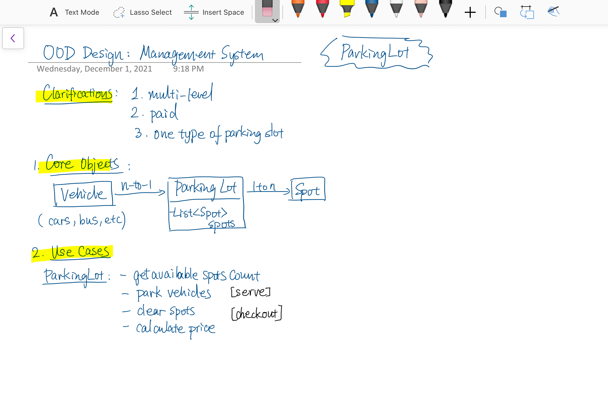
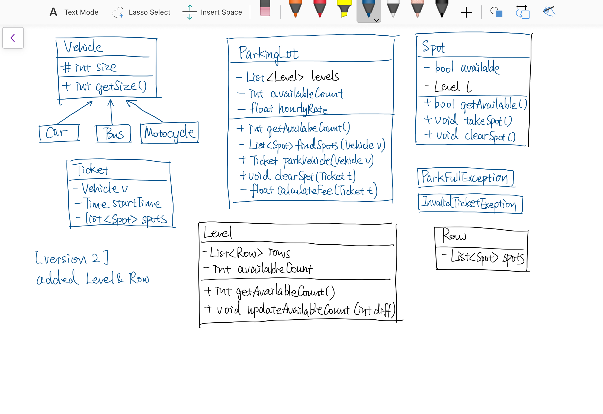

###停车场

这道题让我们实现一个停车位的数据结构，由于题目没给任何多余的信息，所以自由度很大，比如能停放什么种类的车，或是否是多层的等等。根据书中描述，这里我们做如下假设：

1. 停车场有多层，每层有多行停车位

2. 停车场可以停摩托车，小轿车和公交车

3. 停车场有摩托车位，紧凑型车位，和大型车位

4. 摩托车可以停在任何位置

5. 小轿车可以停在紧凑型车位和大型车位

6. 公交车只能停在同一行中连续的五个大型车位上，不能停在小位置上；

>eg

see CC150 OO Design for details.
1) n levels, each level has m rows of spots and each row has k spots.So each level has m x k spots.
2) The parking lot can park motorcycles, cars and buses
3) The parking lot has motorcycle spots, compact spots, and large spots
4) Each row, motorcycle spots id is in range[0,k/4)(0 is included, k/4 is not included), compact spots id is in range [k/4,k/4*3) and large spots id is in range [k/4*3,k).
5) A motorcycle can park in any spot
6) A car park in single compact spot or large spot
7) A bus can park in five large spots that are consecutive and within same row. it can not park in small spots

>design

